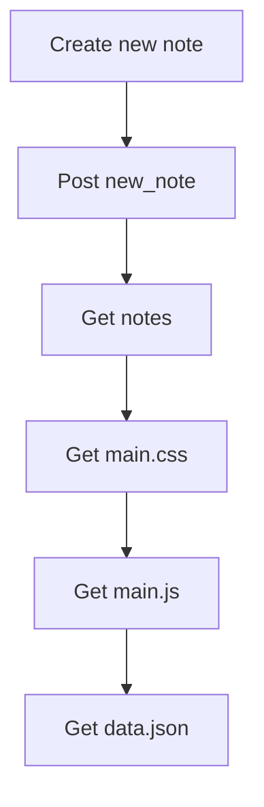
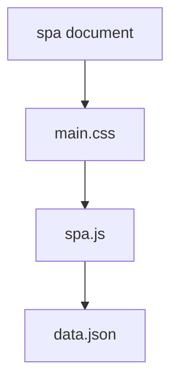
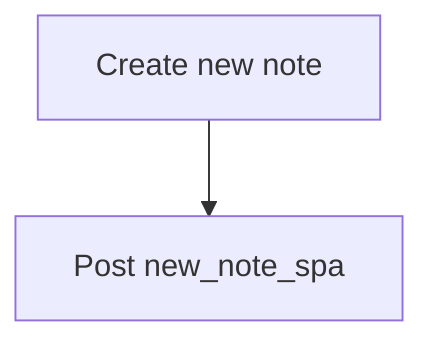

# Part0 exercises
### Exercise 0.4: Mermaid Diagram for creating new note on regular browser

### Exercise 0.5: Mermaid Diagram for using single page app

### Exercise 0.6: Mermaid Diagram for creating new note on single page app

