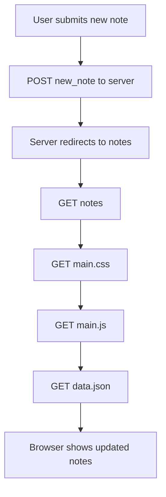
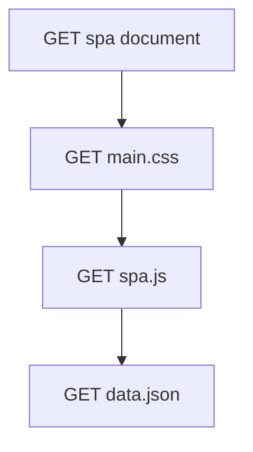
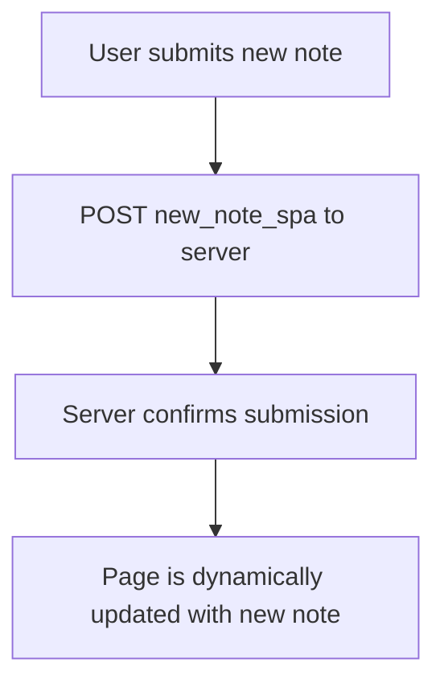

# Part0 exercises
### Exercise 0.4: Mermaid Diagram for creating new note on regular browser

Page will reload with new data

### Exercise 0.5: Mermaid Diagram for using single page app

 Page will dynamically load new note
 
### Exercise 0.6: Mermaid Diagram for creating new note on single page app

